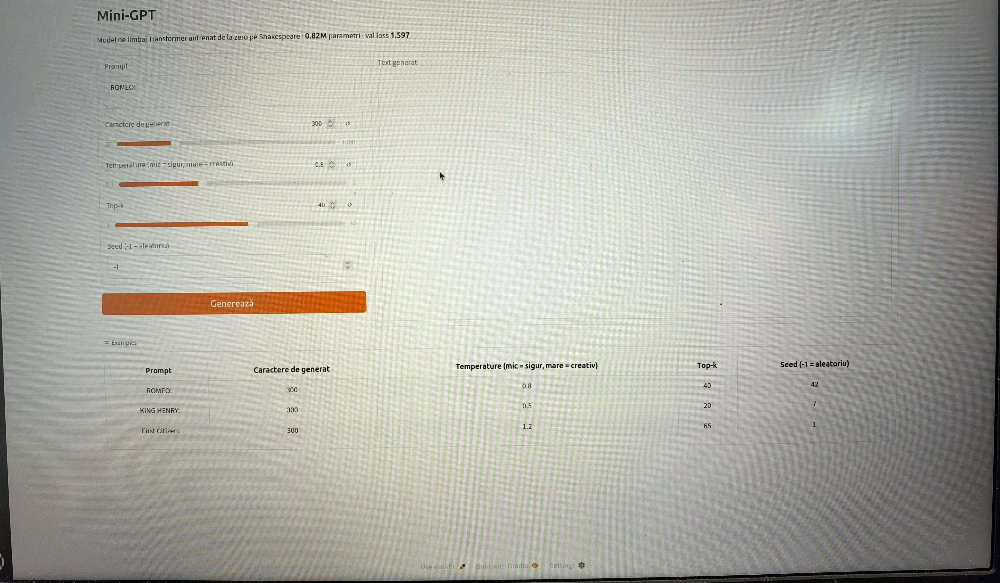
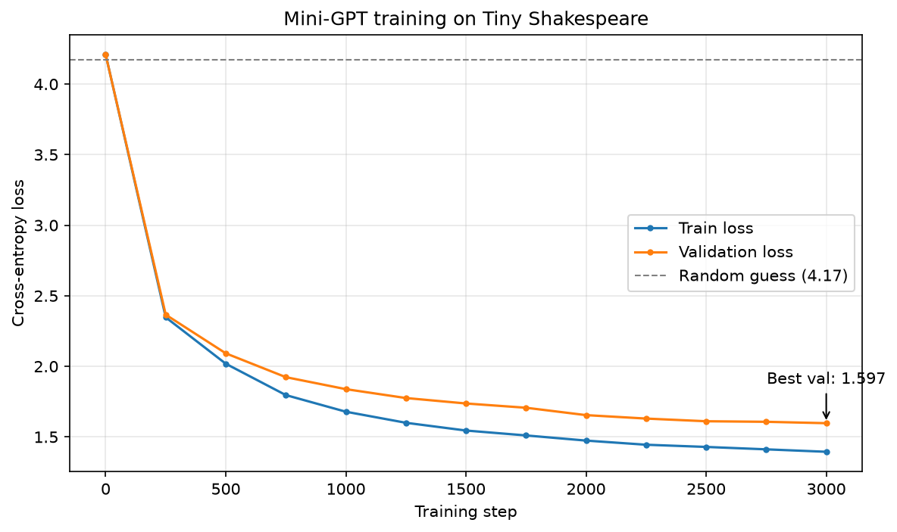

# Mini-GPT

A character-level GPT language model built from scratch in PyTorch.
It is trained on Shakespeare's works and generates new text in the same style.

**▶ Try it online: [gglvxx.github.io/mini-gpt](https://gglvxx.github.io/mini-gpt/)** (runs entirely in your browser)

[](https://gglvxx.github.io/mini-gpt/)


## How it works (in plain English)

**Mini-GPT is a program that taught itself to write in Shakespeare's style, one letter at a time.** Nobody explained English grammar or what a play looks like. It figured everything out from examples.

**What it does.** Think of the word suggestions on your phone keyboard, but at the level of single letters, in a loop:

1. It receives the start of a text, for example `ROMEO:`
2. It guesses the most likely **next letter**
3. It adds that letter to the text and guesses again
4. Repeated a few hundred times, this produces a full passage

**How it learned.** It read about 1 million characters of Shakespeare and played one game thousands of times: *"I hide the next letter, you guess it."* After every mistake, it slightly adjusted its 820,000 internal numbers (parameters). At first it guessed completely at random. By the end, instead of hesitating between all 65 possible characters, it hesitates between about 5 on average.

**What it knows, and what it doesn't.**
- ✅ **Form:** character names in capitals followed by `:`, dialogue on separate lines, real English words, punctuation
- ❌ **Meaning:** the sentences don't make sense. Like a parrot that has listened to thousands of plays, it imitates the sound perfectly without understanding the story.

**How it relates to ChatGPT.** It uses the same core technology, the **Transformer** architecture, and the same principle: *predict the next piece of text*. The difference is scale: this model has 0.82 million parameters and was trained on 1 MB of text, while large models like GPT-3 have 175 billion parameters, read a large part of the internet, and receive extra training to hold conversations.

**Try it yourself.** Open the [live demo](https://gglvxx.github.io/mini-gpt/), type a character name such as `JULIET:`, and press **Generate**. Keep in mind it is not a chatbot: if you ask a question, it won't answer it, it will simply continue the text as if it were a line from a play.

## Features

- **Decoder-only Transformer** implemented from scratch: causal multi-head self-attention, feed-forward layers, residual connections, LayerNorm
- **Character-level tokenizer** with encode/decode roundtrip
- **Hardware-aware config**: automatically uses a larger model when a CUDA GPU is available
- **Training loop** with train/val evaluation, gradient clipping and best-checkpoint saving
- **Loss tracking** with an automatically generated training curve
- **Streaming text generation** with temperature and top-k sampling
- **In-browser inference**: the model is exported to ONNX and runs client-side with ONNX Runtime Web, hosted for free on GitHub Pages, no server needed
- **Local web app** built with Gradio
- **Unit tests** for the tokenizer, dataset and model (including a causal-mask test), run automatically with GitHub Actions

## Architecture

```
Input IDs
   │
Token Embedding + Position Embedding
   │
┌──────────────────────────────┐
│  Transformer Block  × N      │
│   ├─ LayerNorm               │
│   ├─ Causal Self-Attention   │  + residual
│   ├─ LayerNorm               │
│   └─ Feed-Forward (GELU)     │  + residual
└──────────────────────────────┘
   │
Final LayerNorm → Linear → Logits (next-character probabilities)
```

## Project Structure

```
mini-gpt/
├── .github/workflows/   # CI: runs the tests on every push
├── src/
│   ├── config.py        # Hyperparameters and paths
│   ├── tokenizer.py     # Character-level tokenizer
│   ├── dataset.py       # Train/val split and batching
│   └── model.py         # Transformer architecture
├── tests/               # Unit tests (pytest)
├── docs/                # In-browser demo served by GitHub Pages (HTML + ONNX model)
├── assets/              # Images used in this README
├── data/                # Dataset (downloaded, not tracked)
├── checkpoints/         # Trained models and loss history (not tracked)
├── prepare_data.py      # Downloads the dataset
├── train.py             # Trains the model
├── generate.py          # Generates text from the command line
├── export_onnx.py       # Exports the model to ONNX for the browser demo
├── app.py               # Local web interface (Gradio)
├── plot_loss.py         # Plots the training curve
├── pytest.ini
└── requirements.txt
```

## Installation

```bash
git clone https://github.com/gglvxx/mini-gpt.git
cd mini-gpt
python3 -m venv .venv
source .venv/bin/activate

# CPU only (smaller download)
pip install torch --index-url https://download.pytorch.org/whl/cpu
# Or, with an NVIDIA GPU:
# pip install torch

pip install -r requirements.txt
```

## Usage

```bash
# 1. Download the Tiny Shakespeare dataset (~1 MB)
python prepare_data.py

# 2. Train the model
python train.py                    # full training
python train.py --max-iters 300    # quick test run

# 3. Plot the loss curve
python plot_loss.py

# 4. Generate text from the command line
python generate.py --prompt "ROMEO:" --tokens 300
python generate.py --temperature 0.5 --top-k 20 --seed 42

# 5. Launch the local web interface
python app.py

# 6. Export the model for the browser demo, then preview it locally
python export_onnx.py
python -m http.server 8000 --directory docs   # open http://localhost:8000

# 7. Run tests
pytest -v
```

### Generation options

| Argument | Default | Description |
|---|---|---|
| `--prompt` | `\n` | Starting text |
| `--tokens` | `500` | Number of characters to generate |
| `--temperature` | `0.8` | Lower = safer, higher = more creative |
| `--top-k` | `40` | Sample only from the K most likely characters |
| `--seed` | none | Fixed seed for reproducible output |

## Web Demo

### In-browser (online)

**[gglvxx.github.io/mini-gpt](https://gglvxx.github.io/mini-gpt/)**

The trained model is exported to ONNX (`export_onnx.py`) and executed directly in the visitor's browser with ONNX Runtime Web. Sampling (temperature, top-k) is reimplemented in JavaScript. No backend, no GPU, no cost.

To keep the export simple and robust, the model uses a fixed input shape of `[1, 128]`: shorter prompts are right-padded, and the causal mask guarantees the padding never affects the predictions.

### Gradio (local)

```bash
python app.py
# then open http://127.0.0.1:7860
```



## Results

| Setting | Value |
|---|---|
| Hardware | CPU (Intel, Lenovo IdeaPad Slim 3) |
| Parameters | 0.82M |
| Layers / Heads / Embedding | 4 / 4 / 128 |
| Context length | 128 characters |
| Training steps | 3,000 |
| **Validation loss** | **1.597** (random baseline: 4.17) |



### Sample output

```
PASTE YOUR GENERATED TEXT HERE
```

The model learns the **form** of the text (dialogue format, character names, spelling and punctuation), not its meaning. This is expected at this scale.

## Experiments

| Change | Best val loss | Kept? |
|---|---|---|
| Baseline (constant LR 1e-3) | **1.597** | ✅ |
| Cosine LR schedule with warmup (peak 1e-3) | 1.609 | ❌ |

With only 3,000 steps the model is still underfitting, so decaying the learning rate slowed learning down instead of helping.

## Configuration

All hyperparameters live in [`src/config.py`](src/config.py). A small preset is used on CPU, and a larger one (10.8M parameters, 6 layers, 384 embedding) is applied automatically when CUDA is available.

## Acknowledgements

- [Attention Is All You Need](https://arxiv.org/abs/1706.03762) (Vaswani et al., 2017)
- Andrej Karpathy's [nanoGPT](https://github.com/karpathy/nanoGPT) and the *Let's build GPT* lecture
- Dataset: [Tiny Shakespeare](https://github.com/karpathy/char-rnn)
- [ONNX Runtime Web](https://onnxruntime.ai/docs/tutorials/web/) for in-browser inference

## License

[MIT](LICENSE)